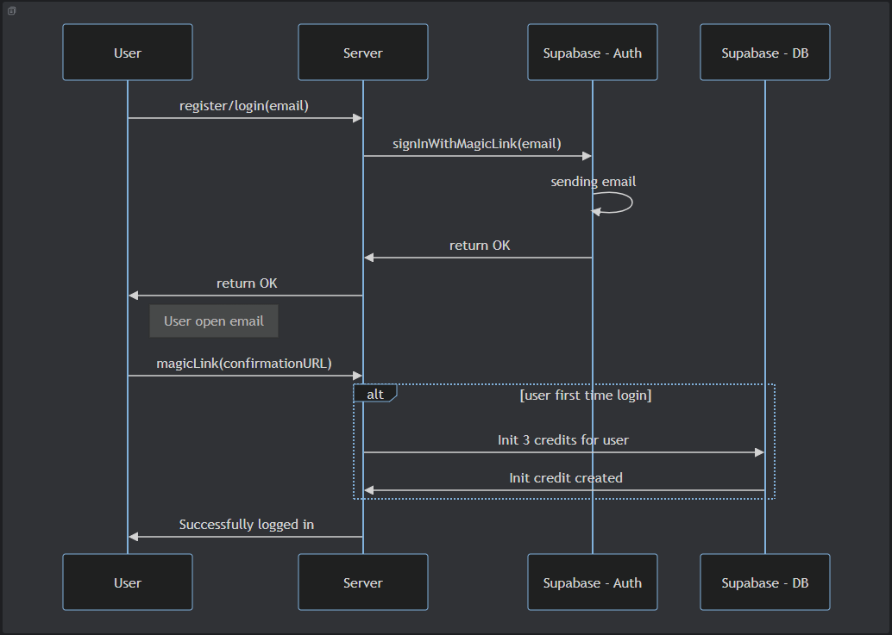
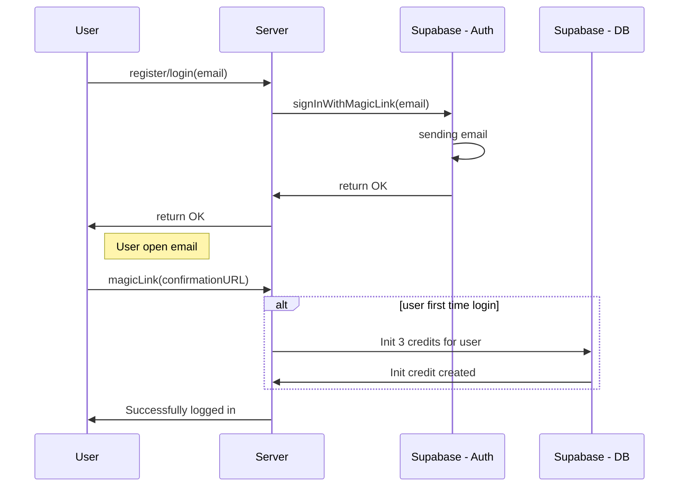
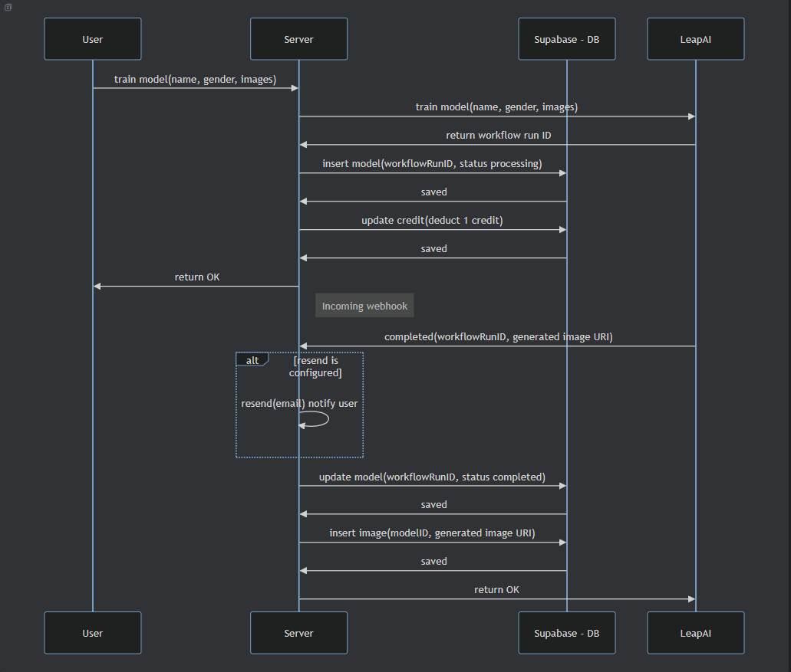
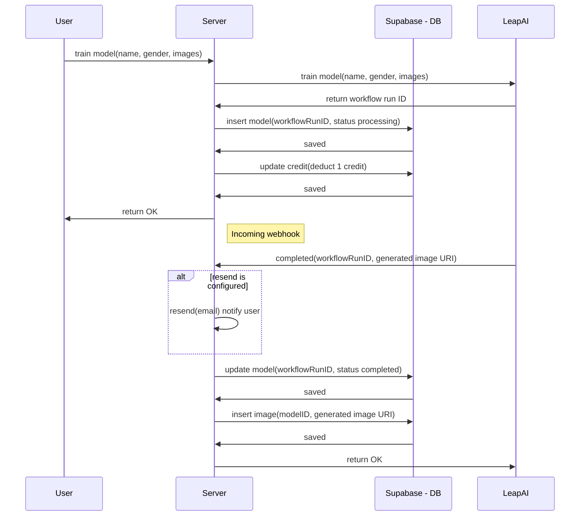

# 👨‍💼 [Headshot AI - SnapWiz](https://headshots-ai-snapwiz.vercel.app/) - Professional Headshots with AI for LinkedIn Profile

Live: https://headshots-ai-snapwiz.vercel.app/ -
You will got 3 credits for the first time to try!

The app is powered by:
- 🚀 [Leap-AI](https://www.astria.ai/) for AI model training & inference
- ▲ x ⚛️ [Next.js and React](https://nextjs.org/) for app and landing page
- 🔋 [Supabase](https://supabase.com/) for DB & Auth
- 📩 [Resend](https://resend.com/) to email user when headshots are ready
- ⭐️ [Shadcn](https://ui.shadcn.com/) with [Tailwind CSS](https://tailwindcss.com/) for styles
- ▲ [Vercel Astria template](https://vercel.com/new/clone?repository-url=https%3A%2F%2Fgithub.com%2Fleap-ai%2Fheadshots-starter%2Ftree%2Fmain&env=ASTRIA_API_KEY,APP_WEBHOOK_SECRET&envDescription=Set%20up%20environment%20variables%20for%20Leap%20AI%20and%20redirect%20URL%20in%20Supabase%20Auth%20dashboard.%20See%20.env.local.example%20for%20full%20config%20with%20Resend%20and%20Stripe.&envLink=https%3A%2F%2Fgithub.com%2Fleap-ai%2Fheadshots-starter%2Fblob%2Fmain%2F.env.local.example&project-name=headshots-starter-clone&repository-name=headshots-starter-clone&demo-title=AI%20Headshot%20Generator&demo-description=A%20Professional%20AI%20headshot%20generator%20starter%20kit%20powered%20by%20Next.js%2C%20Leap%20AI%2C%20and%20Vercel&demo-url=https%3A%2F%2Fwww.getheadshots.ai%2F&demo-image=https%3A%2F%2Fimages.ctfassets.net%2Fe5382hct74si%2F1CEDfTwO5vPEiNMgN2Y1t6%2F245d1e0c11c4d8e734fbe345b9ecdc7c%2Fdemo.png&integration-ids=oac_VqOgBHqhEoFTPzGkPd7L0iH6&external-id=https%3A%2F%2Fgithub.com%2Fleap-ai%2Fheadshots-starter%2Ftree%2Fmain) for deployments
- 💳 [Stripe](https://stripe.com/) for billing

This website created by [Ikhsangama](https://www.linkedin.com/in/ikhsangama/) using template that is released under the [MIT License](https://choosealicense.com/licenses/mit/).

# Sequence Diagram

### Register / Login

### Training image

